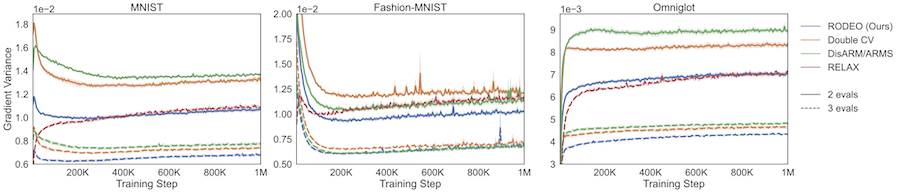

# Gradient Estimation with Discrete Stein Operators

Code for reproducing the results in "Gradient Estimation with Discrete Stein Operators" (NeurIPS 2022 Outstanding Paper Award)
https://arxiv.org/abs/2202.09497.

### Variance of Gradient Estimates for Training VAEs
#### Bernoulli likelihoods


#### Gaussian likelihoods


## Dependencies
```
tensorflow >= 2.5.0
tensorflow-datasets >= 4.2.0
tensorflow-probability >= 0.12.2
scipy >= 1.6.3
absl >= 0.12.0
pandas >= 1.2.4
numpy >= 1.19.5
tqdm >= 4.60.0
```

## Usage
Running VAE experiments:
```
python experiment_launcher_singlelayer.py --dataset={dataset} --genmo_lr={lr} --infnet_lr={lr} --encoder_type=nonlinear --grad_type={grad_type} --K={K} --D=200 --seed={seed}
```

- `dataset`: 
  - dynamically binarized: `mnist`, `fashion_mnist`, `omniglot`.
  - non-binarized: `continuous_mnist`, `continuous_fashion`, `continuous_omniglot`.
- `lr`: 
  - dynamically binarized: `1e-3` for `mnist` and `omniglot`, `3e-4` for `fashion_mnist`.
  - non-binarized: `1e-4`.
- `grad_type`: 
  - REINFORCE leave-one-out: `reinforce_loo`
  - DisARM (Dong et al., 2020): `disarm`
  - Double CV (Titsias & Shi, 2021): `double_cv`
  - RELAX (Grathwohl et al., 2017): `relax` (not affected by `K`, always using 3 evaluations of `f`)
  - ARMS (Dimitriev & Zhou, 2020): `arms`
  - RODEO (ours): 
    - `K=2`: `discrete_stein_avg`
    - `K>2`: `discrete_stein_output_avg`
- `K`: number of samples used, equivalent to number of evaluations of `f` in gradient estimators except RELAX.
- `seed`: 1-5. 

Running hierarchical VAE experiments:
```
python experiment_launcher_multilayer.py --dataset={dataset} --genmo_lr={lr} --infnet_lr={lr} --grad_type={grad_type} --K=2 --seed={seed}
```

## Citation

To cite this work, please use
```
@InProceedings{shi2022gradient,
  title = {Gradient Estimation with Discrete Stein Operators},
  author = {Shi, Jiaxin and Zhou, Yuhao and Hwang, Jessica and Titsias, Michalis K. and Mackey, Lester},
  journal = {arXiv preprint arXiv:2202.09497},
  year = {2022},
}
```

## Acknowledgement

The code is modified from Double CV (https://github.com/thjashin/double-cv), originally based on DisARM (https://github.com/google-research/google-research/tree/master/disarm/binary) and ARMS (https://github.com/alekdimi/arms)
